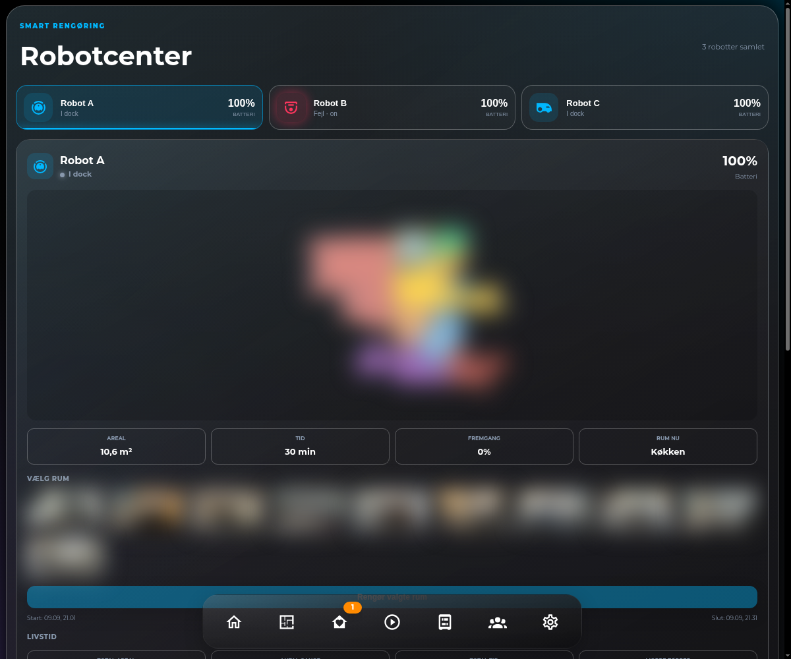

# HA Roborock Vacuum Card

Et omfattende Roborock-kort til Home Assistant med kort, status, batteri, rengøringsdata, vedligehold, moppeindstillinger og valg af flere rum.



## Rumrengøring

`rooms` indeholder Home Assistant area-id'er. Brugeren vælger ét eller flere rum visuelt og starter derefter rengøringen. Kortet kalder `vacuum.clean_area` med de valgte `area_id`-værdier.

```yaml
type: custom:ha-roborock-vacuum-card
title: Robotstøvsuger
vacuum: vacuum.robot
map_image: image.robot_map
battery: sensor.robot_battery
rooms:
  - kitchen
  - living_room
```

Version 0.3.2 placerer rumvalget direkte under kortets aktuelle rengøringsdata og bruger et kompakt, responsivt kortområde.

## Licens

MIT
